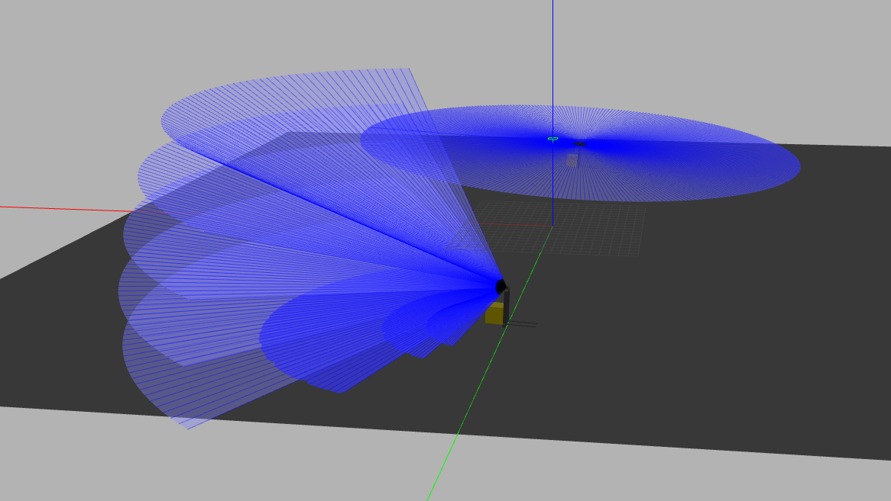

# FactoryBot
This repo is a ROS metapacakge which can be used to simulate AGVs in warehouses. The packages included are:
- `factorybot_gazebo` : Files to create virtual warehouse environments
- `factorybot_description` : Files to create factory robots like AGVs
- `factorybot_teleop` : Files to control factorybot using keyboard in virtual environment
- `factorybot_slam` : Files to setup use of GMapping to create occupancy grids
- `factorybot_bringup` : Launch files to easily run simulations

The robot description contains AGV with 2D and 3D lidar equipped as shown below


The available Gazebo worlds to simulate factory environments are shown below


# Procedure to use the package

## Install ROS Noetic 
    sudo sh -c 'echo "deb http://packages.ros.org/ros/ubuntu $(lsb_release -sc) main" > /etc/apt/sources.list.d/ros-latest.list'
    sudo apt-key adv --keyserver 'hkp://keyserver.ubuntu.com:80' --recv-key C1CF6E31E6BADE8868B172B4F42ED6FBAB17C654
    sudo apt update
    sudo apt install ros-noetic-desktop-full
    echo "source /opt/ros/noetic/setup.bash" >> ~/.bashrc
    source ~/.bashrc

## Install external dependencies
    sudo apt install ros-noetic-gmapping ros-noetic-velodyne-gazebo-plugins

## Create Catkin Workspace and clone repo
    mkdir -p factorybot_catkin_ws/src
    cd factorybot_catkin_ws/src
    git clone git@github.com:ssharma1991/factorybot.git

## Compile
    catkin_make
    source devel/setup.bash

## Run
    roslaunch factorybot_bringup simulation.launch


# Gazebo Tips:

## Setting Models, Plugins & Worlds Path
Gazebo uses many environment variables to locate files. These variables can be edited if the user wants to use additional files. Some examples are as follows
```
export GAZEBO_MODEL_PATH=/home/user/catkin_ws/src/factorybot/factorybot_gazebo/model:$GAZEBO_MODEL_PATH
export GAZEBO_RESOURCE_PATH=/home/user/catkin_ws/src/factorybot/factorybot_gazebo/world:$GAZEBO_RESOURCE_PATH
export GAZEBO_PLUGIN_PATH=/home/user/catkin_ws/build:$GAZEBO_PLUGIN_PATH
```
Check if the paths were set correctly using `env|grep -i gazebo`

## Troubleshoot Gazebo
If previous instances of gzserver have not ended gracefully, the command might not work. Use `killall -9 gzserver` and try again.