# FactoryBot
This repo is a ROS pacakge which simulates AGVs and AMRs in warehouse enviromnents. Multiple localization, mapping, and navigation algorithms are tested using these virtual simulations. 

## Assets
This repo includes urdf files for AGV and AMR, equipped with lidars and cameras as shown below
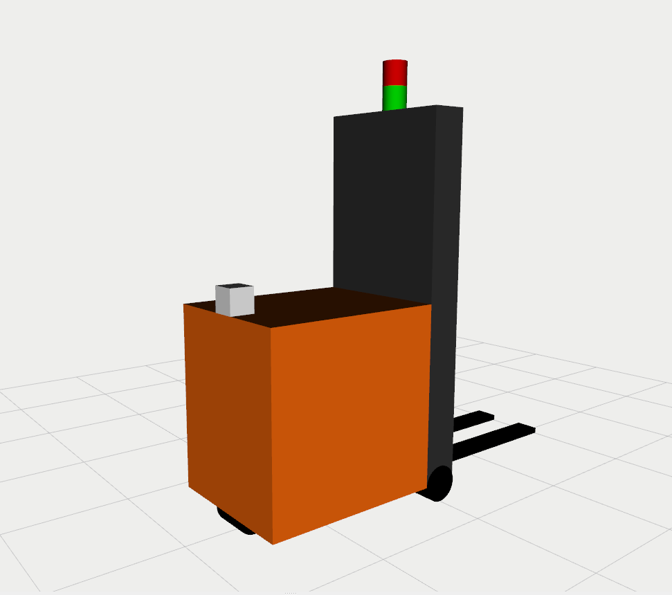
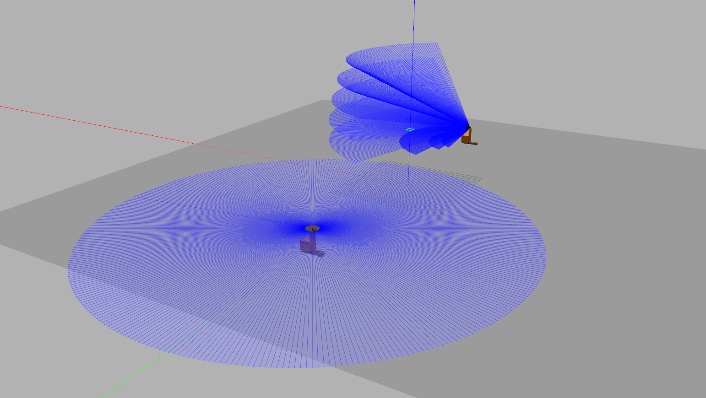
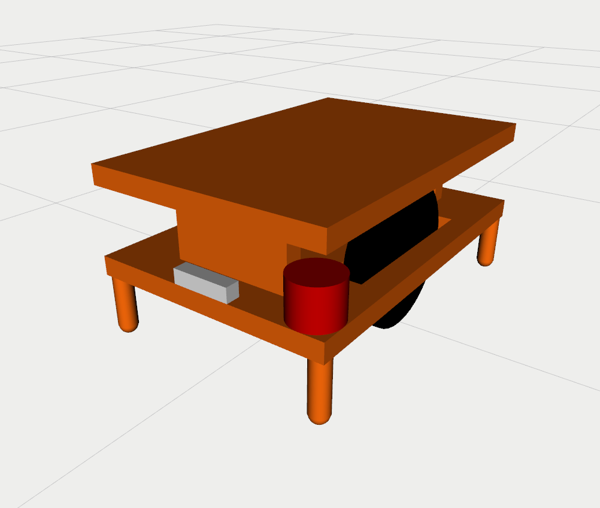
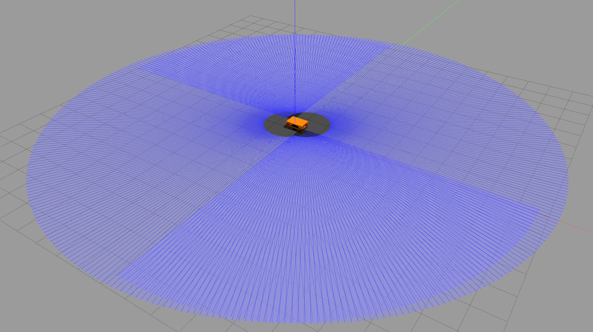

This package also includes Gazebo worlds representing factory environments are shown below
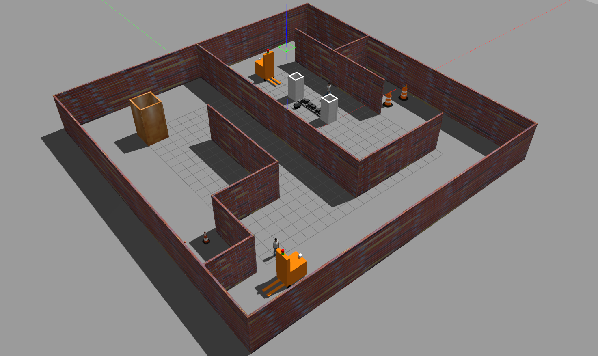
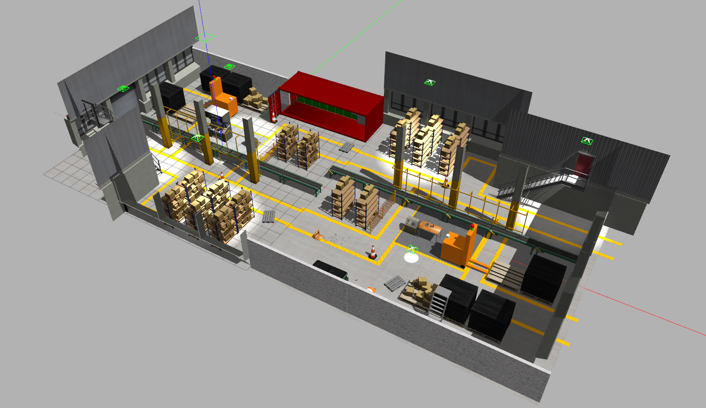

## Demos
The repo included launch files for multiple demo:

- `demo_mapping_gmapping.launch` : Manually move an AGV through a virtual environment and create an occupancy grid map. Mapping is done using [gmapping](http://wiki.ros.org/gmapping). Only a 2D lidar sensor is used.
- `demo_localization_amcl_teleop.launch` : Manually move an AMR through a previously mapped virtual environment while localizing. Localization is done using [AMCL](http://wiki.ros.org/amcl). Only a 2D lidar sensor is used.
- `demo_localization_amcl_nav.launch` : Autonomously move an AMR through a previously mapped virtual environment while localizing and path planning. Path planning is done using [move_base](http://wiki.ros.org/move_base) and localization is done using [AMCL](http://wiki.ros.org/amcl). Only a 2D lidar is used.

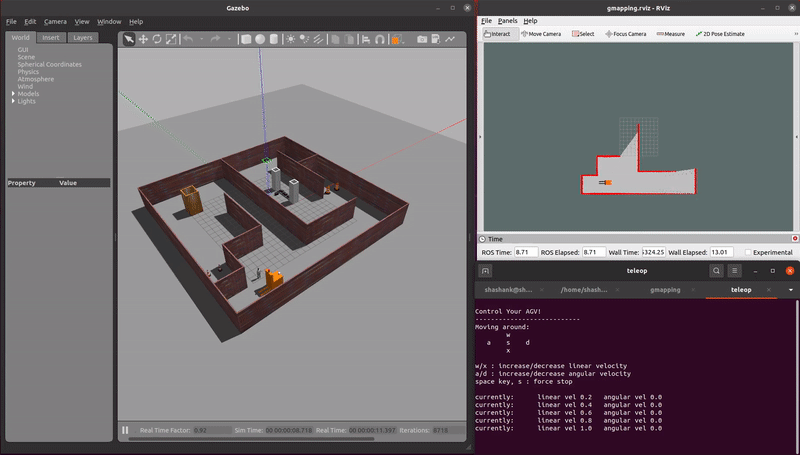


- `demo_mapping_rtabmap.launch` : Manually move an AMR through a virtual environment and create a loop-closed 3D graph map using [RTAB-Map](http://wiki.ros.org/rtabmap_ros). A 3D camera sensor with a 2D lidar sensor is used.
- `demo_localization_rtabmap.launch` : Manually move an AMR through a previously mapped virtual environment and localize using [RTAB-Map](http://wiki.ros.org/rtabmap_ros). A 3D camera sensor with a 2D lidar sensor is used.

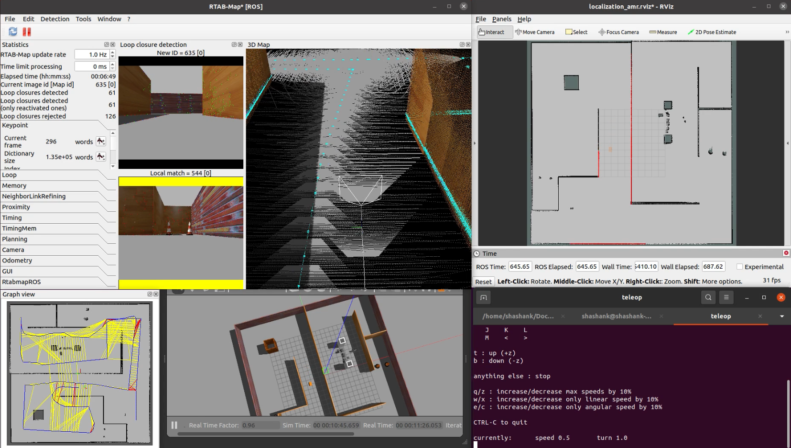
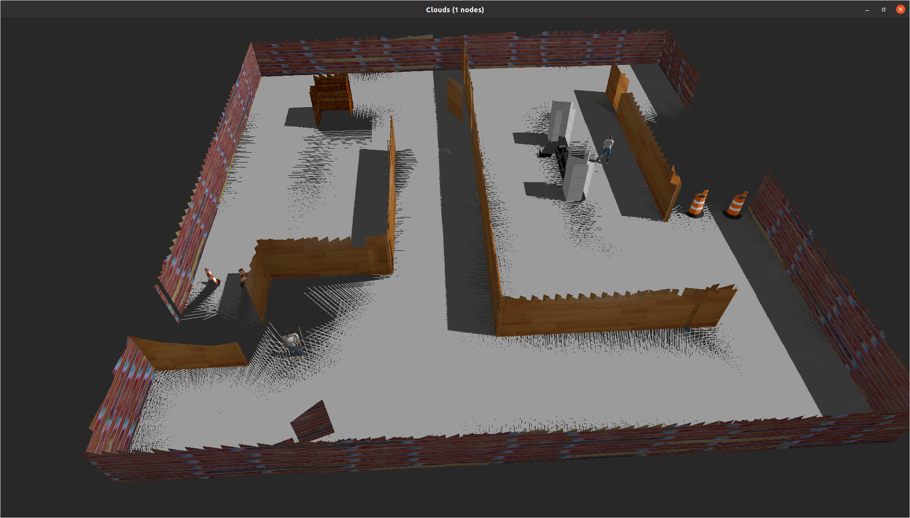
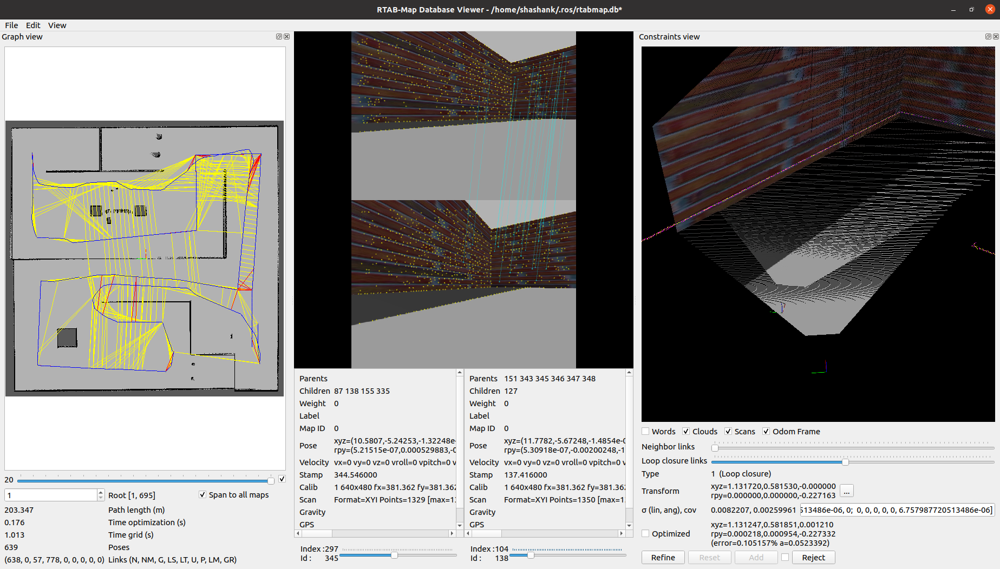

- `demo_ball_chasing.launch` : An AMR autonomously follows a reflective ball target as the ball moves through the virtual environment. A RGB camera sensor is used.


- `demo_pick_and_place.launch` : An AMR autonomously completes a sequence movements to simulate a payload pick and place operation.

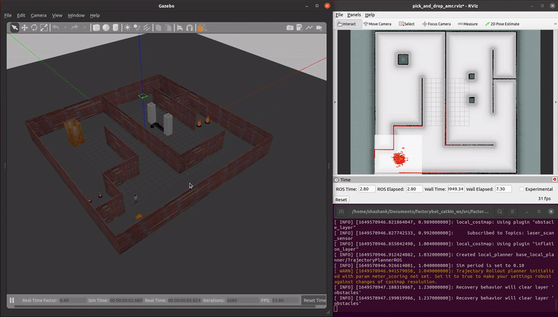

Videos for each demo are available here: https://github.com/ssharma1991/factorybot/tree/main/videos

# Procedure to use the package

## Install ROS Noetic 
    sudo sh -c 'echo "deb http://packages.ros.org/ros/ubuntu $(lsb_release -sc) main" > /etc/apt/sources.list.d/ros-latest.list'
    sudo apt-key adv --keyserver 'hkp://keyserver.ubuntu.com:80' --recv-key C1CF6E31E6BADE8868B172B4F42ED6FBAB17C654
    sudo apt update
    sudo apt install ros-noetic-desktop-full
    echo "source /opt/ros/noetic/setup.bash" >> ~/.bashrc
    source ~/.bashrc

## Install external dependencies
    sudo apt install ros-noetic-gmapping ros-noetic-velodyne-gazebo-plugins

## Create Catkin Workspace and clone repo
    mkdir -p factorybot_catkin_ws/src
    cd factorybot_catkin_ws/src
    git clone git@github.com:ssharma1991/factorybot.git

## Compile
    catkin_make
    source devel/setup.bash

## Run demos
    roslaunch factorybot demo_mapping_gmapping.launch
    roslaunch factorybot demo_localization_amcl_teleop.launch
    roslaunch factorybot demo_localization_amcl_nav.launch
    roslaunch factorybot demo_mapping_rtabmap.launch
    roslaunch factorybot demo_localization_rtabmap.launch
    roslaunch factorybot demo_ball_chasing.launch
    roslaunch factorybot demo_pick_and_place.launch

# Gazebo Tips:

## Setting Models, Plugins & Worlds Path
Gazebo uses many environment variables to locate files. These variables can be edited if the user wants to use additional files. Some examples are as follows
```
export GAZEBO_MODEL_PATH=/home/user/catkin_ws/src/factorybot/factorybot_gazebo/model:$GAZEBO_MODEL_PATH
export GAZEBO_RESOURCE_PATH=/home/user/catkin_ws/src/factorybot/factorybot_gazebo/world:$GAZEBO_RESOURCE_PATH
export GAZEBO_PLUGIN_PATH=/home/user/catkin_ws/build:$GAZEBO_PLUGIN_PATH
```
Check if the paths were set correctly using `env|grep -i gazebo`

## Troubleshoot Gazebo
If previous instances of gzserver have not ended gracefully, the command might not work. Use `killall -9 gzserver` and try again.